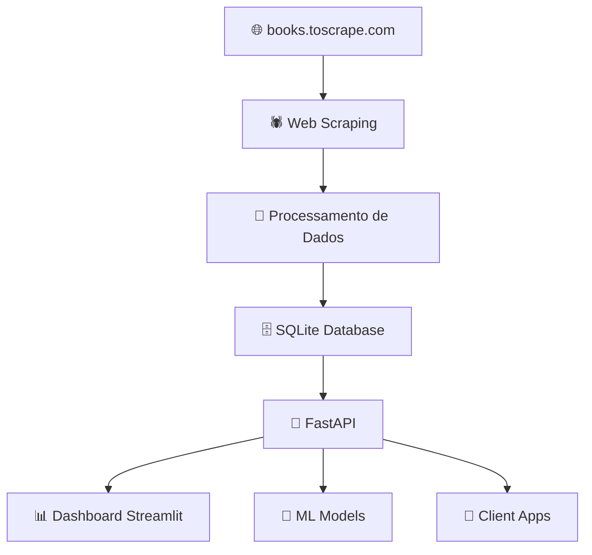

# 📚 Book Public API - Tech Challenge


API pública para consulta de livros, criada como infraestrutura inicial para futuros sistemas de recomendação com machine learning.

## 🚀 Visão Geral

Este projeto implementa um pipeline completo de dados desde a extração até a disponibilização via API REST, desenvolvido para atender cientistas de dados e sistemas de recomendação de livros. A solução foi construída com foco em escalabilidade, modularidade e futura integração com modelos de machine learning.

### 🎯 Objetivos

- ✅ Criar infraestrutura de dados escalável para recomendação de livros
- ✅ Desenvolver API REST pública para consulta de dados estruturados
- ✅ Implementar pipeline ETL robusto e automatizado
- 🔄 Preparar ambiente para integração com modelos ML

## 🏗️ Arquitetura

A arquitetura segue os princípios de separação de responsabilidades e modularidade:

```
techChallenge/
├── api/                      # 🚀 API FastAPI
│   ├── __pycache__/
│   ├── auth/                # 🔐 Autenticação
│   ├── core/                # ⚙️ Configurações centrais
│   ├── dependencies/        # 📦 Dependências da API
│   ├── logger/              # 📝 Sistema de logs
│   ├── models/              # 🗃️ Modelos de dados (SQLAlchemy)
│   ├── routes/              # 🛣️ Rotas da API
│   ├── schemas/             # 📋 Schemas Pydantic
│   └── main.py             # 🎯 Aplicação principal
├── dashboard/               # 📊 Dashboard Streamlit
│   ├── __pycache__/
│   ├── app.py              # 📈 App principal do dashboard
│   ├── charts.py           # 📊 Gráficos e visualizações
│   ├── data.py             # 📋 Processamento de dados
│   └── layout.py           # 🎨 Layout da interface
├── scraping/               # 🕷️ Scripts de Web Scraping
│   ├── __pycache__/
│   ├── books.py            # 📚 Scraper de livros
│   └── core.py             # ⚙️ Funcionalidades centrais
├── tests/                  # 🧪 Testes automatizados
├── view/                   # 👁️ Visualizações
├── .env.example            # 📝 Exemplo de variáveis de ambiente
├── .gitignore             # 🚫 Arquivos ignorados pelo Git
├── arquitetura_api.drawio  # 🏗️ Diagrama da arquitetura
├── poetry.lock           # 🔒 Lock de dependências Poetry
├── pyproject.toml        # ⚙️ Configuração do projeto
├── README.md             # 📖 Este arquivo
├── requirements.txt      # 📋 Dependências pip
├── requirements-dashboard.txt  # 📊 Dependências do dashboard
└── vercel.json          # ⚡ Configuração do Vercel
```

### 🔄 Pipeline de Dados



**Fluxo**: Ingestão → Processamento → Armazenamento → API → Consumo

1. **🕷️ Ingestão**: Web scraping automatizado do site books.toscrape.com
2. **🧹 Processamento**: Limpeza, transformação e estruturação dos dados
3. **🗄️ Armazenamento**: Persistência em banco SQLite
4. **🚀 API**: Disponibilização via endpoints REST documentados
5. **📊 Visualização**: Dashboard interativo com Streamlit
6. **🤖 Consumo**: Utilização por cientistas de dados e sistemas ML

## 🛠️ Instalação e Configuração

### 📋 Pré-requisitos

- Python 3.12+
- pip ou Poetry
- Git

### ⚡ Instalação Rápida

```bash
# Clone o repositório
git clone https://github.com/seu-usuario/tech-challenge-book-api.git
cd tech-challenge-book-api

python -m venv venv
source venv/bin/activate  # Linux/Mac
# ou
venv\Scripts\activate     # Windows

pip install -r requirements.txt
```

### ⚙️ Configuração

```bash
# Configure as variáveis de ambiente
cp .env.example .env

# Edite o arquivo .env
DATABASE_URL=sqlite:///./books.db
API_HOST=0.0.0.0
API_PORT=8000
DEBUG=True
```

### 🗄️ Inicialização do Banco

```bash
# Execute o scraping para popular o banco
python -m scraping.books

# Ou execute manualmente
python scraping/books.py
```

## 🕷️ Web Scraping

### 🚀 Execução

O pacote scraping contém todas as funções relativas ao web scraper. A função `download_catalogue_data`, que pode ser acionada pelo endpoint `/scraping/trigger` da API, extrai os dados dos livros disponíveis em books.toscrape.com e os salva com uma tabela de um banco de dados SQLite.

### 📊 Dados Extraídos

O script coleta os seguintes campos de cada livro:

| Campo | Descrição | Exemplo |
|-------|-----------|---------|
| **id** | Número único de identificação do registro do livro | 1 |
| **title** | Nome completo do livro | "A Light in the Attic" |
| **price** | Valor em libras (£) | 51.77 |
| **rating** | Avaliação de 1 a 5 estrelas | 3 |
| **stock** | Estoque disponível do livro | 22 |
| **category** | Gênero/categoria do livro | "Poetry" |
| **cover** | Capa do livro em bytes | "\xff\xd8\xff\xe0\x00\x10JFIF" |

## 🚀 Executando a API

### 🛠️ Desenvolvimento

```bash
# Inicie a API em modo desenvolvimento
uvicorn api.main:app --reload --port 8000

# A API estará disponível em:
# 🌐 API: http://localhost:8000
# 📚 Documentação Swagger: http://localhost:8000/docs
# 📋 ReDoc: http://localhost:8000/redoc
```

### 🏭 Produção

```bash
# Com uvicorn
uvicorn api.main:app --host 0.0.0.0 --port $PORT --workers 4

# Com gunicorn
gunicorn api.main:app -w 4 -k uvicorn.workers.UvicornWorker
```

## 📊 Dashboard

### 🎯 Executando o Dashboard

```bash
# Instale as dependências específicas
pip install -r requirements-dashboard.txt

# Execute o dashboard
streamlit run dashboard/app.py

# Acesse: adicionar url
```

### 📈 Funcionalidades do Dashboard

- 📊 **Estatísticas Gerais**: Total de livros, preço médio, categorias
- 📈 **Gráficos Interativos**: Distribuição por categoria, faixa de preços
- 🔍 **Filtros Avançados**: Por categoria, rating, preço
- 📋 **Tabelas Dinâmicas**: Lista de livros com ordenação

## 📡 Documentação da API

### 🌐 Base URLs

- **Desenvolvimento**: `http://localhost:8000`
- **Produção**: `https://nome-app.vercel.app`

### 🛣️ Endpoints Principais

#### 📚 Livros

**GET /api/v1/books**
- **Descrição**: Lista todos os livros com paginação
- **Parâmetros**:
  - `skip` (int, opcional): Registros a pular (default: 0)
  - `limit` (int, opcional): Limite por página (default: 20, max: 100)
  - `title` (str, opcional): Filtro por título
  - `category` (str, opcional): Filtro por categoria

**Exemplo de Request:**
```bash
curl -X GET "http://localhost:8000/api/v1/books?limit=5&category=Fiction"
```

**Exemplo de Response:**
```json
{
  "books": [
    {
      "id": 1,
      "title": "A Light in the Attic",
      "price": 51.77,
      "rating": 3,
      "availability": "In stock (22 available)",
      "category": "Poetry",
      "image_url": "catalogue/images/products/a-light-in-the-attic_1000/a-light-in-the-attic_1000.jpg"
    }
  ],
  "total": 1000,
  "skip": 0,
  "limit": 5
}
```

**GET /api/v1/books/{id}**
- **Descrição**: Retorna detalhes de um livro específico
- **Parâmetros**: `id` (int, obrigatório): ID do livro

**Exemplo:**
```bash
curl -X GET "http://localhost:8000/api/v1/books/1"
```

#### 📊 Estatísticas

**GET /api/v1/books/stats**
- **Descrição**: Estatísticas gerais da coleção

**Response:**
```json
{
  "total_books": 1000,
  "total_categories": 50,
  "average_price": 35.67,
  "average_rating": 3.2,
  "most_expensive": {
    "title": "Book Title",
    "price": 59.99
  },
  "cheapest": {
    "title": "Another Book",
    "price": 10.00
  }
}
```

**GET /api/v1/categories**
- **Descrição**: Lista todas as categorias com contagem

**Response:**
```json
{
  "categories": [
    {
      "name": "Fiction",
      "count": 65,
      "average_price": 32.45
    },
    {
      "name": "Mystery",
      "count": 32,
      "average_price": 38.20
    }
  ]
}
```

#### ❤️ Health Check

**GET /health**
- **Descrição**: Status da API e conectividade

```json
{
  "status": "healthy",
  "timestamp": "2024-01-15T10:30:00Z",
  "version": "1.0.0",
  "database": "connected",
  "total_books": 1000,
  "uptime": "2 days, 5 hours"
}
```

### 🔍 Filtros Avançados

**GET /api/v1/books/search**
- **Parâmetros**:
  - `q` (str): Busca textual no título
  - `min_price` (float): Preço mínimo
  - `max_price` (float): Preço máximo
  - `rating` (int): Rating específico
  - `category` (str): Categoria43

**Exemplo:**
```bash
curl -X GET "http://localhost:8000/api/v1/books/search?q=light&min_price=20&max_price=60&rating=3"
```

<!-- ## 🚀 Deploy

### ⚡ Vercel (Recomendado)

```bash
# Instale o Vercel CLI
npm i -g vercel

# Deploy
vercel

# Configure as variáveis de ambiente no dashboard do Vercel
``` -->

<!-- ### 🐳 Docker

```dockerfile
# Dockerfile
FROM python:3.9-slim

WORKDIR /app
COPY requirements.txt .
RUN pip install -r requirements.txt

COPY . .
EXPOSE 8000

CMD ["uvicorn", "api.main:app", "--host", "0.0.0.0", "--port", "8000"]
```

```bash
# Build e run
docker build -t book-api .
docker run -p 8000:8000 book-api
```

### ☁️ Heroku

```bash
# Crie o Procfile
echo "web: uvicorn api.main:app --host=0.0.0.0 --port=\$PORT" > Procfile

# Deploy
heroku create your-app-name
git push heroku main
``` -->

## 📈 Cenários de Uso

### 🔬 Para Cientistas de Dados

```python
import requests
import pandas as pd

# Obter todos os dados para análise
response = requests.get('https://api.com/api/v1/books?limit=1000')
books_data = response.json()['books']
df = pd.DataFrame(books_data)

# Análise de preços por categoria
stats_response = requests.get('https://api.com/api/v1/books/stats')
stats = stats_response.json()

print(f"Total de livros: {stats['total_books']}")
print(f"Preço médio: £{stats['average_price']}")
```

### 🤖 Para Sistemas de Recomendação

```python
import requests

# Buscar livros similares por categoria
def get_books_by_category(category, limit=10):
    url = f"https://api.com/api/v1/books"
    params = {"category": category, "limit": limit}
    response = requests.get(url, params=params)
    return response.json()['books']

# Análise de ratings para recomendações
def get_top_rated_books(min_rating=4):
    url = f"https://api.com/api/v1/books/search"
    params = {"rating": min_rating}
    return requests.get(url, params=params).json()
```

### 📱 Para Aplicações Frontend

```javascript
// React/JavaScript example
const BookAPI = {
  baseURL: 'https://api.com/api/v1',
  
  async getBooks(filters = {}) {
    const params = new URLSearchParams(filters);
    const response = await fetch(`${this.baseURL}/books?${params}`);
    return response.json();
  },
  
  async getBookById(id) {
    const response = await fetch(`${this.baseURL}/books/${id}`);
    return response.json();
  },
  
  async searchBooks(query) {
    const response = await fetch(`${this.baseURL}/books/search?q=${query}`);
    return response.json();
  }
};

// Uso
const books = await BookAPI.getBooks({ category: 'Fiction', limit: 20 });
```

### 📝 Guidelines

1. **Code Style**: Seguimos PEP 8 com Black e isort
2. **Commits**: Use Conventional Commits
3. **Tests**: Mantenha coverage > 80%
4. **Documentation**: Documente APIs e funções complexas


## 🌐 Links Importantes

- **🚀 API em Produção**: [Em breve]()
- **📚 Documentação Swagger**: [Em breve]()
- **📊 Dashboard**: [Em breve]()
- **🐛 Issues**: [GitHub Issues](https://github.com/seu-usuario/tech-challenge-book-api/issues)

## 👥 Equipe de Desenvolvimento

| Nome | GitHub |
|------|--------|
| **Cindy Kanashiro** | [@cindykanashiro](https://github.com/cindykanashiro) |
| **André Rafael** | [@Andre-Rafael](https://github.com/Andre-Rafael) |
| **Cláudio Lavezzo** | [@clavezzo-25](https://github.com/clavezzo-25) |
| **Rogério Cabriotte** | [@cabriotte](https://github.com/cabriotte) |
| **Carlos Eduardo** | [@c-sant](https://github.com/c-sant) |

---
